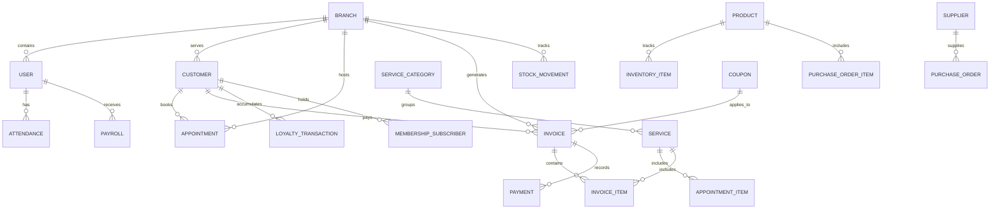

# Super Art Hair Salon - Enterprise Salon ERP & Management System (SaaS-Ready)

This repository contains the complete codebase for a modern, scalable, and production-grade Salon Billing, Scheduling & Management ERP system. It is designed to act as a commercial SaaS product (similar to Zenoti or Fresha), optimized for multi-branch environments, with dynamic RBAC controls, a robust scheduling/checkout engine, and detailed analytics.

---

## 📂 Project Folder Structure

```text
/
├── backend/
│   ├── src/
│   │   ├── config/             # DB & server configuration keys
│   │   ├── controllers/        # Express handlers (Auth, Invoices, Staff, etc.)
│   │   ├── middlewares/        # Authentication, Error handling, RBAC, Validation
│   │   ├── models/             # Mongoose Schemas (User, Role, Product, etc.)
│   │   ├── routes/             # REST Endpoints
│   │   ├── utils/              # Token encoders, Custom error class, Seeder script
│   │   └── validators/         # Zod schemas for incoming requests
│   ├── package.json
│   ├── tsconfig.json
│   └── Dockerfile
├── frontend/
│   ├── src/
│   │   ├── components/         # Reusable widgets
│   │   ├── context/            # AuthContext (JWT rotation, Session memory)
│   │   ├── layouts/            # DashboardLayout (Filtered navigation by permissions)
│   │   ├── pages/              # POS Checkout, Analytics, Scheduler, CRM lists
│   │   ├── services/           # Axios interceptors handling automatic cookie refreshes
│   │   ├── utils/              # Class combining widgets (cn.ts)
│   │   ├── App.tsx
│   │   └── main.tsx
│   ├── package.json
│   ├── tsconfig.json
│   ├── tailwind.config.js
│   └── Dockerfile
├── docker-compose.yml
└── README.md
```

---

## 🗄️ Database Design & ER Diagram

The database utilizes **MongoDB Atlas** with Mongoose. 24 interrelated collections are structured to handle billing ledger audits, real-time availability checks, and multi-tenant segmentation.

### Mongoose Relational Visualizer


---

## 🔒 Authentication & RBAC

The system employs a dual-JWT cookie-based mechanism:
1. **Access Token (15m expiration)**: Passed as a secure cookie (`accessToken`) to authenticate requests.
2. **Refresh Token (7d expiration)**: Passed as a secure, `HttpOnly` cookie (`refreshToken`). Used to rotate and generate new tokens automatically on expiration.
3. **Role-Based Permissions**: Dynamic middleware (`requirePermission('billing:create')`) locks endpoints according to the user's role configuration.
4. **Active Session Guard**: If a user's status changes to 'suspended' or 'pending', the middleware blocks request processing instantly.

---

## 🔌 API Documentation & Endpoint Matrix

All endpoints are versioned under `/api/v1/` and accept/return standard payloads:

| HTTP Method | Route | Description | Permission required |
| :--- | :--- | :--- | :--- |
| `POST` | `/api/v1/auth/register` | Register owner accounts | Public |
| `POST` | `/api/v1/auth/login` | Login user, sets HTTP-only cookies | Public |
| `POST` | `/api/v1/auth/refresh` | Rotate access & refresh tokens | Public |
| `POST` | `/api/v1/auth/logout` | Revoke tokens & clean cookies | Public |
| `GET` | `/api/v1/auth/profile` | Retrieve active profile sessions | Auth Required |
| `POST` | `/api/v1/invoices` | COMPLETE POS CHECKOUT ENGINE | `billing:create` |
| `GET` | `/api/v1/invoices/:id` | Retrieve invoice invoice details | Auth Required |
| `POST` | `/api/v1/invoices/:id/refund` | Refund invoice, updates stock | `billing:void` |
| `GET` | `/api/v1/coupons/validate` | Validates active discount coupons | Auth Required |
| `POST` | `/api/v1/appointments` | Create appointment (conflict checked) | Auth Required |
| `PUT` | `/api/v1/appointments/:id/status`| Update status (pending, completed, checked-in)| Auth Required |
| `GET` | `/api/v1/inventory` | List branch stock counts | `inventory:view` |
| `POST` | `/api/v1/inventory` | Adjust absolute quantity levels | `inventory:edit` |
| `POST` | `/api/v1/inventory/transfer` | Multi-branch inventory movements | `inventory:edit` |
| `POST` | `/api/v1/payroll` | Calculate stylist base + commissions | `payroll:process` |
| `GET` | `/api/v1/dashboard/stats` | Aggregated Recharts analytical metrics | `branches:view` |

---

## 💻 UI/UX Design Aesthetic

The frontend dashboard follows a **modern luxury SaaS layout**:
- **Palette**: Sleek slate black (`#0a0a0c`) combined with vibrant violet (`#8b5cf6`) and warm gold (`#eab308`) accents.
- **Visuals**: Dynamic glassmorphism panels, loading skeleton outlines, responsive drawer sliders, toast popups, and Recharts trends.
- **POS Checkout Grid**: Dedicated search selectors, stylist assignees per item, discount coupon validation engines, and instant ES/POS mock thermal receipt printing drawers.
- **Stylist Agenda Calendar**: Visual columns aligning active stylist work schedules with booked appointment blocks.

---

## 🐳 Docker Deployment & Composition

Orchestrate the entire platform in a single command. The compose files set up a local MongoDB container, Express server, and Nginx container:

```bash
# Build and run containers
docker-compose up --build -d

# Verify containers are running
docker ps
```
Services exposed:
- **Frontend SPA**: [http://localhost:80](http://localhost:80)
- **Backend API**: [http://localhost:5000](http://localhost:5000)
- **Database Port**: `27017`

---

## 🛠️ Local Development & Seed Guide

### 1. Prerequisites
- Node.js (v20+), npm (v10+), and a local MongoDB instance.

### 2. Setting Up Backend
```bash
cd backend
npm install
npm run seed  # Compiles seeder and populates branches, products, stylists
npm run dev   # Starts Nodemon on port 5000
```

### 3. Setting Up Frontend
```bash
cd frontend
npm install
npm run dev   # Starts Vite Dev Server on port 5173
```
- Open [http://localhost:5173](http://localhost:5173) in browser.
- Login with:
  - **Super Admin**: `superadmin@salonerp.com` / `admin123`
  - **Receptionist**: `receptionist@salonerp.com` / `receptionist123`

---

## ⚡ Production Best Practices, Performance & Security

### Security Checklist
- [x] **Secure Cookies**: HTTP-only, secure, lax/strict flag cookies preventing XSS-driven token extraction.
- [x] **API Rate Limiting**: Limit of 300 requests per 15 minutes per IP to block DDoS attempts.
- [x] **Helmet Headers**: Enabled helmet middlewares to secure Express against common vulnerabilities (XSS, clickjacking).
- [x] **Zod Validation**: Validates incoming payload types on both server and client to avoid MongoDB injection.

### Performance Optimizations
- **Index Optimization**: Compound indexes configured on `appointments`, `invoices`, and `inventory` to optimize high-volume queries.
- **Token Rotation**: Keep max 5 active refresh tokens per user to prevent bloat.
- **Aggregation Pipelines**: MongoDB aggregation queries used to calculate dashboard statistics and payroll commissions in a single step.

### Future Scalability Plan
- **Multi-Tenancy Integration**: Add a `tenantId` field to every document to convert the monorepo into a multi-tenant B2B SaaS.
- **Serverless Scaling**: Express API layers are compatible with AWS Lambda or Vercel Serverless deployments.
